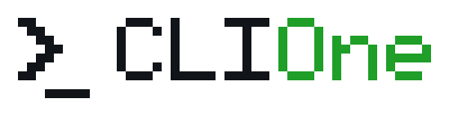

<p align="center">
  <picture>
    <source media="(prefers-color-scheme: dark)" srcset="assets/logo.svg">
    
  </picture>
</p>

<p align="center">
  <a href="https://github.com/dierodfer/cliOne/actions/workflows/ci.yml"></a>
  <a href="https://github.com/dierodfer/cliOne/actions/workflows/pr.yml"></a>
</p>

CLIOne is a cross-platform TUI (Linux/macOS) that gives you visibility into the
developer tools installed on your machine, organized by category, and updates
them using each tool's **own native update mechanism**. It never installs
anything from scratch: for tools that are not installed, or that have no native
updater, it simply shows a link to the official install page.

Built with [Bubble Tea](https://github.com/charmbracelet/bubbletea) and
[Lip Gloss](https://github.com/charmbracelet/lipgloss).

## Usage

```sh
make build      # builds bin/clione
./bin/clione    # opens the TUI (the primary, full-featured surface)
```

The TUI is where browsing, filtering, doctor/conflicts, and update actions
live. `clione` also has a few non-interactive subcommands for scripting and
CI — each is a thin wrapper over the same engine the TUI uses, so behavior
never diverges between the two:

```sh
clione list             # print every catalog tool, grouped by category
clione list --refresh   # same, but force a live latest-version check first
clione doctor           # print PATH conflicts (headless version of the `d` view)
clione update <tool-id> # run one tool's update non-interactively
clione --version        # print the app version and exit
```

`clione update <tool-id>` never installs anything from scratch, matching the
TUI: it runs a native/manager update when one exists, otherwise it prints the
official page and exits non-zero. Exit codes: `0` success or already up to
date, `1` the update ran and failed, `2` unknown tool ID, `3` nothing
runnable (redirected to the official page).

### Shell completion

Completion covers the top-level flags (`--version`, `--help`); the `update`/
`doctor`/`list` subcommands aren't completion-aware yet. Ready-made scripts
live in [`completions/`](completions/):

```sh
make completions          # list the available scripts
make install-completions  # install them for bash, zsh, and fish
```

`install-completions` copies the scripts to the standard per-user locations
(`~/.local/share/bash-completion/completions`, `~/.local/share/zsh/site-functions`,
`~/.config/fish/completions`). Override `BASH_COMPLETION_DIR`,
`ZSH_COMPLETION_DIR`, or `FISH_COMPLETION_DIR` to install elsewhere. For zsh,
make sure the target directory is in your `fpath`. Restart your shell to
activate.

The tree shows every catalog tool grouped by category, with a 4-state
semaphore per row:

| Icon | Meaning |
|------|---------|
| 🟢 | installed and up to date |
| 🟡 | installed, a newer version is available (whenever it is out of date) |
| 🔴 | not installed (row shows the official install page) |
| ⚪ | installed, but the latest version could not be verified |

Rows also show the detected version, the newest known version when an update
is available, and which package manager owns the binary (homebrew, cargo, npm,
uv, apt/dnf, or manual).

### Keys

| Key | Action |
|-----|--------|
| `↑`/`↓` (or `k`/`j`) | navigate |
| `enter` / `→` | expand/collapse a category, or act on a tool row |
| `u` | same as enter on a tool row: run the native/manager update when one exists (🟡), otherwise open the official page (🔴/⚪, or 🟡 with no updater) |
| `/` | fuzzy text filter (enter to keep, esc to clear) |
| `p` | cycle profile (Backend / Frontend / DevOps / AI / Full Stack / All) — filters the tree by category, combinable with `/` |
| `d` | doctor view: read-only, scrollable list of tools that resolve at more than one `$PATH` location, with the active one marked (`↑`/`↓` scrolls, `esc`/`d` goes back) |
| `r` | force a live re-check of every installed tool's latest version, ignoring the cache's TTL |
| `l` | on a row whose update failed: toggle an inline panel with the tail of stderr |
| `esc` / `←` | collapse / back / clear filter |
| `q` | quit |

### How updates work

- Tools with a bespoke native updater declared in the catalog (e.g.
  `rustup update`, `brew update`, `copilot update`) run that command.
- Tools owned by a package manager (Homebrew, cargo, npm global, uv) run the
  manager's own upgrade command (`brew upgrade <pkg>`,
  `cargo install <pkg> --force`, ...), synthesized at runtime.
- Everything else (distro packages, manual installs) gets a link to the
  official page. CLIOne never invents an install path.

Latest versions come from each manager's own metadata (crates.io, the npm
registry, PyPI, `brew info`) or, for manually installed GitHub-hosted tools,
from the `releases/latest` redirect — no GitHub REST API, no rate limits.
Results are cached in `~/.cache/clione/cache.json` (source ownership for 7
days, latest versions for 12 hours) so the tree renders instantly; rows
refresh in place asynchronously.

## Development

```sh
make build   # go build -> bin/clione
make test    # go test ./...
make vet     # go vet ./...
make lint    # golangci-lint if installed, else go vet
make run     # go run ./cmd/clione
```

The tool catalog lives in `internal/catalog/data/tools.yaml` and is embedded
into the binary; its schema is documented in
[docs/catalog-schema.md](docs/catalog-schema.md).

### Logo

The logo is pixel art — a shell prompt followed by `CLI` in the neutral ink
and `One` in the brand green (`#35C93A`) — kept in one form per surface:

| File | Use |
|------|-----|
| `assets/logo.svg` / `assets/logo.png` | transparent, light ink — for dark backgrounds |
| `assets/logo-light.svg` / `assets/logo-light.png` | transparent, dark ink — for light backgrounds |
| `internal/tui/banner.go` | the same artwork as half-block text, shown on the TUI's startup splash |

All four image files have a transparent background; the README picks the
light or dark variant from `prefers-color-scheme`. The SVGs are a grid of
1x1 rects on a 50x13 viewBox, one row of the bitmap per `y` — edit those and
the PNGs and the banner have to be updated to match.

## Releasing

Create and publish a release from the GitHub UI as usual (pick or create a
`vX.Y.Z` tag, write notes, click Publish). The `release.yml` workflow then
builds `clione` for linux/darwin × amd64/arm64 with that tag stamped in as
the version (shown by `clione --version` and in the TUI header) and attaches
the binaries plus a `checksums.txt` to that same release — it never creates
a release on its own.
